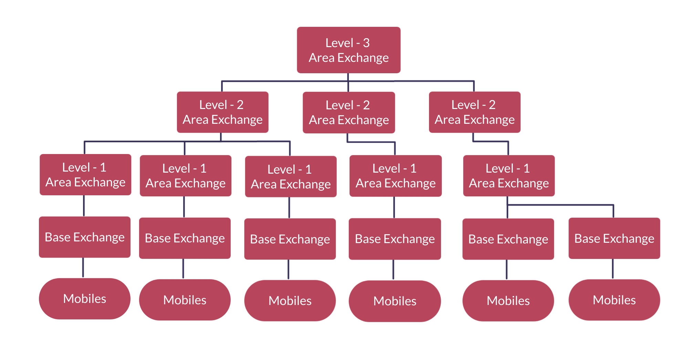

# Mobile-Tracker

Modelling mobile network communication hierarchy and simulating mobile location tracking.

## Introduction

This is a simple python-based implementation for simulating mobile tracking. 

Each mobile phone that is switched on is connected to the base station which is nearest. These base stations are popularly called cell phone towers. Although sometimes we may be within range of more than one base station, each phone is registered to exactly one base station at any point of time. When the phone moves from the area of one base station to another, it will be de-registered at its current base station and re-registered at new base station.

  

The base stations are further serviced by area exchanges which are themselves serviced by higher level area exchanges in a heirarchial manner, as illustrated in the example image above. Whenever a phone call is made, the location of the mobile is searched in this 'network' of exchanges, and a heirarchial structure allows efficient searching.

A detailed Problem statement can be found [here](./Problem-Statement.pdf)

## Modelling the Problem

The heirarchial structure of exchanges is modelled by a tree. The collection of mobiles in each exchange is being modelled as a custom defined set. While searching for a mobile's location, the set of mobiles of different exchanges is checked and the leaf exchange with the mobile is found!

## Instructions for use

Clone the repo and open a terminal inside this folder. 

Add/change an [actions](./actions/) file according to what actions you want to perform in the routing map. Follow the [format](./actions/format.txt) provided.

After that, simply run `main.py` with path of the actions file:

Example usage:
~~~
python3 main.py --actions actions/actions1.txt
~~~

## App

For better visualisation of the network structure as well as a more intuitive way of accepting actions, a flask app is being developed. It is deployed on heroku [here](https://mysterious-woodland-91712.herokuapp.com).

